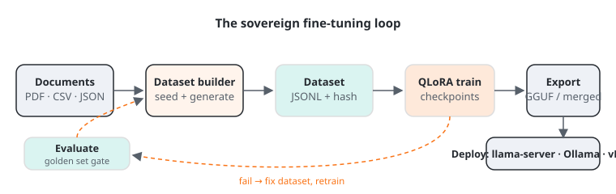

#  {#finetune}

::: {.en}
Every training GUI walks through the same four areas. LLaMA-Factory's WebUI, Unsloth Studio and TextGen's Training tab all ask for the same six answers before they can start.[^ch06-trainers] Underlying concepts:

**Methods.** What changes the model's weights:

| Method | Mechanism | VRAM | When |
|---|---|---|---|
| **SFT** (supervised fine-tuning) | Train on instruction→output pairs | n/a | Teach format, tone, domain knowledge |
| **QLoRA** | Freeze 4-bit base, train low-rank adapters (~1 % of params) | Lowest | Default choice; matches LoRA quality since dynamic 4-bit[^ch06-qlora] |
| **LoRA** | Same adapters on a 16-bit base | Medium | When serving will be 16-bit |
| **Full FT** | Update all weights | Highest | Rarely needed; if LoRA fails, FFT won't save it |
| **RL: GRPO / DPO** | Learn from rewards or preference pairs instead of labels | n/a | Tool-calling behaviour, reasoning, alignment to taste |

Fine-tuning can inject knowledge *and* behaviour. It can replicate what RAG does, not vice versa. Loss around 0.5–1.0 is typically healthy. Loss ≈ 0 means overfitting, so check eval loss.

{#fig-pipeline width=100%}

::: {.al-take}
**Our take.** Fine-tuning is the most fun part of this book and the one we recommend least often. In our experience, 8 out of 10 "we need to fine-tune" requests dissolve once the team writes a real system prompt, a few good few-shot examples, or a small RAG loop. Train when you need *behaviour* the base model refuses to adopt. Format discipline, domain tone, tool-calling style. Not when you merely need it to know things.
:::

**The four areas of any trainer GUI:**

1. **Model & method.** Pick modality (text/vision/audio/embeddings), choose the method (QLoRA/LoRA/Full), then type any HF model name. Gated models (Llama, Gemma) need an HF token, validated inline. Defaults are pre-filled automatically. GGUF files are inference-only. Training needs safetensors. CLI trainers (Axolotl, torchtune) ask the same questions as flags in a YAML file.[^ch06-trainers]
2. **Dataset.** Pull from Hugging Face Hub or drop local `PDF / DOCX / JSONL / JSON / CSV / Parquet`. Format detection: `auto`, `alpaca` (instruction/input/output), `chatml` (messages array), `sharegpt`. Choose train/eval splits (an eval split enables the Eval-Loss chart) and optionally slice rows for quick experiments. A column-mapping dialog opens when roles aren't obvious.
3. **Hyperparameters.** Sound defaults (context 2048, LR 2e-4, LoRA rank 16 / alpha 32 / dropout 0.05, all attention+MLP projections targeted, 3 epochs, batch 4 × grad-accum 8, AdamW 8-bit, linear scheduler, warmup 5, gradient checkpointing, seed 3407). Each one explained in [§ Training hyperparameters](07-hyperparametres-entrainement.qmd#hyper). Optional W&B / TensorBoard logging.
4. **Training & config.** Save/Upload/Reset the whole config as **YAML** (`{model}_{method}_{dataset}_{timestamp}.yaml`). Reproducible and versionable, and directly reusable by a CLI trainer. Start Training validates inline (e.g. eval steps without eval split).

**Observability during training:** live loss (raw + EMA-smoothed + average), LR schedule, gradient norm, eval loss; GPU monitor (util%, °C, VRAM, watts) polled every few seconds; ETA and tokens/s; viewable from your phone. Stop & Save checkpoints at any time.
:::

::: {.fr}
Toute interface d'entraînement traverse les mêmes quatre zones. Le WebUI de LLaMA-Factory, Unsloth Studio et l'onglet Training de TextGen posent les mêmes six questions avant de démarrer.[^ch06-trainers] Concepts sous-jacents :

**Méthodes.** Ce qui modifie les poids :

| Méthode | Mécanisme | VRAM | Quand |
|---|---|---|---|
| **SFT** (fine-tuning supervisé) | Entraînement sur paires instruction→sortie | n/a | Apprendre format, ton, connaissance métier |
| **QLoRA** | Base gelée en 4-bit, adaptateurs low-rank (~1 % des paramètres) | Minimale | Choix par défaut ; égale la qualité LoRA grâce au 4-bit dynamique[^ch06-qlora] |
| **LoRA** | Mêmes adaptateurs sur base 16-bit | Moyenne | Si vous servez ensuite en 16-bit |
| **Full FT** | Mise à jour de tous les poids | Maximale | Rarement nécessaire ; si LoRA échoue, FFT ne sauvera rien |
| **RL : GRPO / DPO** | Apprentissage par récompenses ou paires de préférence | n/a | Comportements d'outils, raisonnement, alignement |

Le fine-tuning injecte connaissances *et* comportement. Il peut répliquer ce que fait le RAG, pas l'inverse. Une perte autour de 0,5–1,0 est généralement saine. Perte ≈ 0 = surapprentissage : vérifiez la perte d'éval.

{#fig-pipeline-fr width=100%}

::: {.al-take}
**Notre avis.** Le fine-tuning est la partie la plus amusante de ce livre et celle que nous recommandons le moins souvent. D'expérience, 8 demandes de fine-tuning sur 10 se dissolvent une fois l'équipe dotée d'un vrai prompt système, de quelques bons exemples few-shot ou d'une petite boucle RAG. Entraînez quand vous avez besoin d'un *comportement* que le modèle de base refuse d'adopter. Discipline de format, ton métier, style d'appels d'outils. Pas quand il suffit qu'il sache des choses.
:::

**Les quatre zones de toute interface d'entraînement :**

1. **Modèle & méthode.** Modalité (texte/vision/audio/embeddings), méthode (QLoRA/LoRA/Full), nom HF libre. Modèles gated (Llama, Gemma) : token HF validé en ligne. Défauts pré-remplis automatiquement. Les GGUF sont inférence seule. L'entraînement exige des safetensors. Les affûteurs en ligne de commande (Axolotl, torchtune) posent les mêmes questions sous forme de drapeaux dans un fichier YAML.[^ch06-trainers]
2. **Jeu de données.** Depuis le Hub HF ou en glissant `PDF / DOCX / JSONL / JSON / CSV / Parquet`. Formats : `auto`, `alpaca` (instruction/input/output), `chatml` (tableau messages), `sharegpt`. Choix des splits train/éval (un split d'éval active la courbe Eval-Loss) et slicing de lignes pour tester vite. Une boîte de mappage de colonnes s'ouvre si les rôles ne sont pas évidents.
3. **Hyperparamètres.** Défauts sains (contexte 2048, LR 2e-4, rang LoRA 16 / alpha 32 / dropout 0,05, toutes les projections attention+MLP ciblées, 3 epochs, batch 4 × accum. grad. 8, AdamW 8-bit, scheduler linéaire, warmup 5, gradient checkpointing, graine 3407). Chacun expliqué en [§ Hyperparamètres d'entraînement](07-hyperparametres-entrainement.qmd#hyper). Logging W&B / TensorBoard optionnel.
4. **Entraînement & config.** Save/Upload/Reset de toute la config en **YAML** (`{modèle}_{méthode}_{dataset}_{horodatage}.yaml`). Reproductible, versionnable, et directement réutilisable par un affûteur en CLI. Start Training valide en ligne (ex. eval steps sans split d'éval).

**Observabilité pendant l'entraînement :** perte live (brute + lissée EMA + moyenne), courbe de LR, norme de gradient, perte d'éval ; moniteur GPU (util. %, °C, VRAM, watts) rafraîchi toutes les quelques secondes ; ETA et tokens/s ; consultable depuis un téléphone. Stop & Save pour checkpointer à tout moment.
:::

::: {.notes}
Walk through an actual training of ~10 min on a rented GPU or shared server; stop at the loss curves. / Déroulez un vrai entraînement de ~10 min sur un GPU loué ou partagé ; arrêtez-vous sur les courbes de perte.
:::

[^ch06-qlora]: Dettmers, Pagnoni, Holtzman, Zettlemoyer, *QLoRA: Efficient Finetuning of Quantized LLMs*, NeurIPS 2023 (arXiv:2305.14314): NF4 4-bit base + low-rank adapters matches 16-bit LoRA and full fine-tuning quality on their benchmarks. LoRA itself: Hu et al., 2021 (arXiv:2106.09685).
[^ch06-trainers]: Trainer GUIs and their CLI equivalents: LLaMA-Factory WebUI (llamafactory.readthedocs.io), Unsloth Studio (unsloth.ai/docs), TextGen's Training tab (github.com/oobabooga/text-generation-webui), Axolotl (docs.axolotl.ai), torchtune (pytorch.org/torchtune), all checked 2026-10-04. The YAML a GUI writes is the same artefact a CLI trainer reads.
